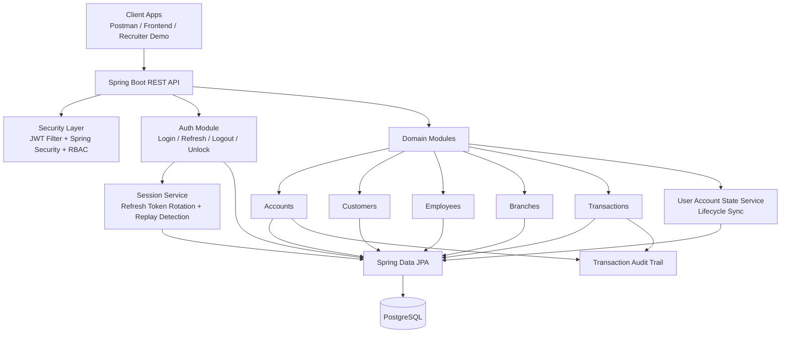

# Banking System API

A production-style banking backend built with Spring Boot that models customers, employees, branches, accounts, transactions, and secure authentication flows.

This project is stronger than a CRUD demo. It combines role-based access control, JWT authentication, refresh-token session management, account lifecycle rules, and transaction auditing in a single service-oriented backend.

## Quick Summary

- Secure banking backend for account, customer, employee, branch, and transaction management.
- Built with Spring Boot, Spring Security, JPA, PostgreSQL, and JWT-based authentication.
- Designed around real-world concerns: RBAC, session management, lifecycle-driven access control, and auditable money movement.

## Architecture Diagram



This architecture separates authentication, authorization, domain logic, and persistence so the project remains understandable now and easier to extend later.

## Why This Project Stands Out

- Implements domain-driven banking workflows instead of generic sample APIs.
- Uses JWT access tokens plus persisted refresh-token sessions with token rotation and replay detection.
- Applies method-level authorization with seeded roles and granular permissions.
- Synchronizes user login state automatically from customer, employee, and account lifecycle changes.
- Records successful and failed financial operations as transaction history.
- Includes business rules for account closure, blocking, activation, insufficient funds, password expiry, and staged login lockouts.

## Core Capabilities

### Authentication and Security
- Stateless Spring Security configuration with JWT-based authentication.
- Login, refresh session, logout, logout-all-devices, password change, and admin unlock flows.
- Refresh tokens are hashed before storage.
- Rotated refresh tokens are tracked to detect token reuse.
- Password-expiry policy is configurable.
- Failed logins trigger a temporary lock first, then escalate to admin unlock if another failed attempt happens after the temporary lock window.

### Authorization Model
- Role and permission bootstrap on application startup via `DataInitializer`.
- Example roles include:
  - `CUSTOMER`
  - `TELLER`
  - `BRANCH_MANAGER`
  - `OPERATIONS_OFFICER`
  - `SUPPORT_AGENT`
  - `COMPLIANCE_OFFICER`
  - `FRAUD_ANALYST`
  - `INTERNAL_AUDITOR`
  - `ADMIN`
  - `SECURITY_ADMIN`
- Example permissions include:
  - `VIEW_ACCOUNT`
  - `CREATE_ACCOUNT`
  - `DEPOSIT`
  - `WITHDRAW`
  - `TRANSFER`
  - `FREEZE_ACCOUNT`
  - `UNFREEZE_ACCOUNT`
  - `VIEW_TRANSACTION_HISTORY`
  - `UNLOCK_ACCOUNT`

### Banking Operations
- Create and manage accounts linked to customers and branches.
- Deposit, withdraw, and transfer funds between accounts.
- Fetch account-level and system-level transaction history.
- Filter accounts by status, customer, or balance range.
- Prevent invalid financial operations such as:
  - deposits into blocked or closed accounts
  - withdrawals from blocked or closed accounts
  - transfers involving non-active accounts
  - account closure when balance is not zero

### Lifecycle Management
- Customers can be reactivated by reusing existing inactive records.
- Employees can be rehired by reusing terminated records.
- Branches can be reopened by reusing closed records.
- User login state is recalculated from linked customer/employee/account status:
  - inactive customer -> user disabled
  - blocked customer or blocked accounts -> user locked
  - all customer accounts closed -> user disabled
  - suspended or on-leave employee -> user locked
  - terminated employee -> user disabled and locked

## Architecture Snapshot

Package structure is organized by feature:

- `account` - account APIs, DTOs, persistence, lifecycle, and balance operations
- `auth` - login/session management, users, roles, permissions, and unlock flows
- `branch` - branch onboarding and lifecycle
- `customer` - customer onboarding and lifecycle
- `employee` - employee onboarding and lifecycle
- `transaction` - transaction querying, persistence, and transfer support
- `security` - JWT filter, security config, custom user details, token service
- `config` - JWT/security properties and role-permission bootstrap
- `exception` - centralized API error mapping

## Tech Stack

- Java 17
- Spring Boot 4.0.3
- Spring Security
- Spring Data JPA
- Spring Validation
- PostgreSQL
- H2 for tests
- Maven Wrapper
- SpringDoc OpenAPI / Swagger UI
- Lombok

## API Surface

Base paths currently exposed by the application:

- `/api/auth`
- `/api/accounts`
- `/api/customers`
- `/api/employees`
- `/api/branches`
- `/api/transactions`

### Representative Endpoints

Authentication:
- `POST /api/auth/sessions`
- `POST /api/auth/sessions/refresh`
- `DELETE /api/auth/sessions`
- `DELETE /api/auth/sessions/all`
- `PUT /api/auth/password`
- `POST /api/auth/users/unlock`

Accounts:
- `POST /api/accounts`
- `GET /api/accounts/{accountNumber}`
- `GET /api/accounts?status={status}`
- `GET /api/accounts?customerId={customerId}`
- `GET /api/accounts?minBalance={min}&maxBalance={max}`
- `PATCH /api/accounts/{accountNumber}`
- `PATCH /api/accounts/{accountNumber}/status`
- `POST /api/accounts/{accountNumber}/deposits`
- `POST /api/accounts/{accountNumber}/withdrawals`
- `POST /api/accounts/transfers`
- `GET /api/accounts/{accountNumber}/transactions`

Transactions:
- `GET /api/transactions`
- `GET /api/transactions/{transactionId}`
- `GET /api/transactions/reference/{referenceNumber}`

## Configuration

Application config lives in [src/main/resources/application.properties](/Users/vishalsharma/IdeaProjects/banking-system/src/main/resources/application.properties).

Environment variables:

- `DB_HOST` default `localhost`
- `DB_PORT` default `5432`
- `DB_NAME` default `banking_system`
- `DB_USERNAME` default `postgres`
- `DB_PASSWORD` default `postgres`
- `JWT_SECRET` required, use a strong secret with at least 32 bytes of entropy

Important runtime properties:

- `app.jwt.expiration-minutes` default `600`
- `app.jwt.refresh-token-days` default `7`
- `app.security.password-expiry-months` default `6`
- `app.security.max-failed-login-attempts` default `5`
- `app.security.lock-duration-minutes` default `30`
- `app.security.auth-state-sync-cron` default hourly

An example environment file is provided at [.env.example](/Users/vishalsharma/IdeaProjects/banking-system/.env.example).

## Local Setup

### Prerequisites
- JDK 17+
- PostgreSQL
- Maven optional, wrapper included

### 1. Create the database

```sql
CREATE DATABASE banking_system;
```

### 2. Configure environment

```bash
export DB_HOST=localhost
export DB_PORT=5432
export DB_NAME=banking_system
export DB_USERNAME=postgres
export DB_PASSWORD=postgres
export JWT_SECRET='replace-with-a-long-random-secret'
```

### 3. Run the application

```bash
./mvnw spring-boot:run
```

The API runs on `http://localhost:9090`.

### 4. Run tests

```bash
./mvnw test
```

## API Docs

After startup:

- Swagger UI: `http://localhost:9090/swagger-ui.html`
- OpenAPI JSON: `http://localhost:9090/v3/api-docs`

## Testing

Current automated coverage includes:

- Spring Boot context smoke test
- authentication-service tests for staged lockout and admin-unlock escalation

This is a solid start for security-sensitive logic, though broader controller and integration coverage would still strengthen the project further.

## Recruiter-Focused Highlights

If you are reviewing this project as a portfolio piece, the most relevant engineering signals are:

- secure session lifecycle design, not only login/logout endpoints
- business-rule enforcement around financial state transitions
- method-level RBAC backed by seeded permissions and roles
- lifecycle-aware identity state management across multiple linked domains
- structured package organization that is easy to extend into a larger banking platform

## Author

Vishal Sharma
